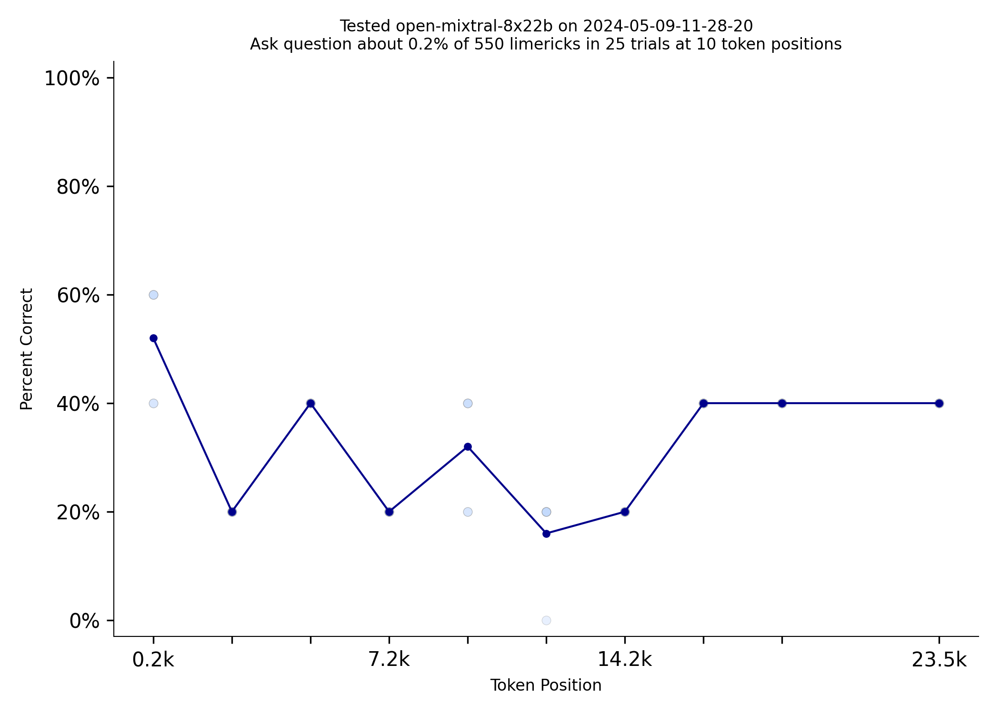
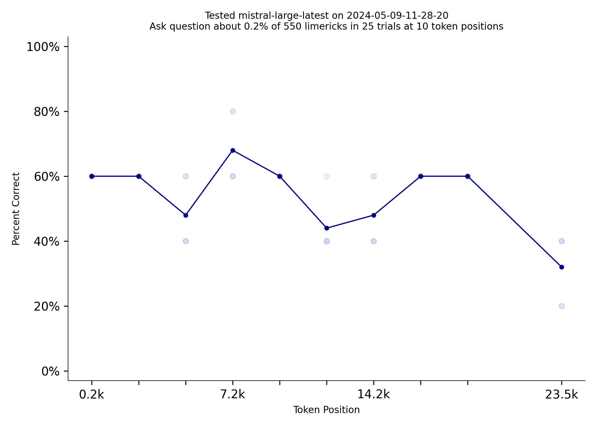
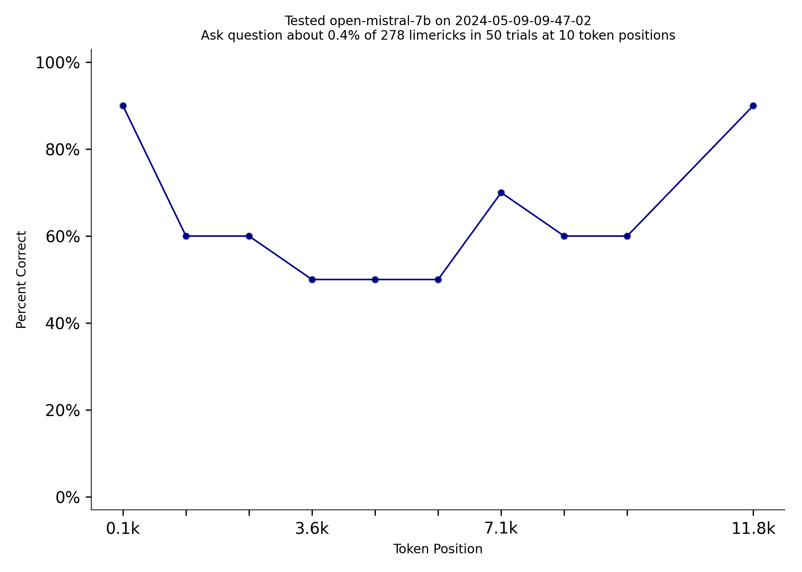
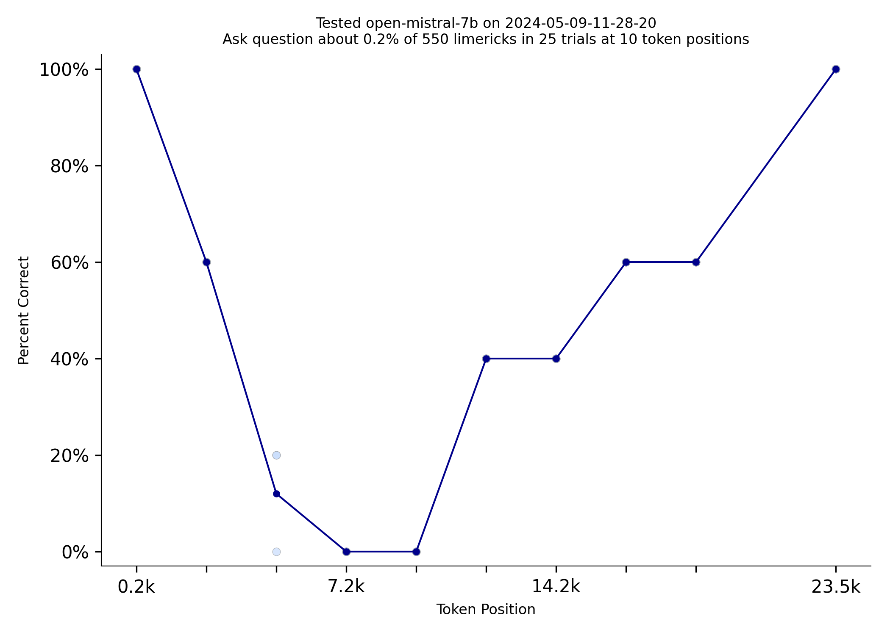
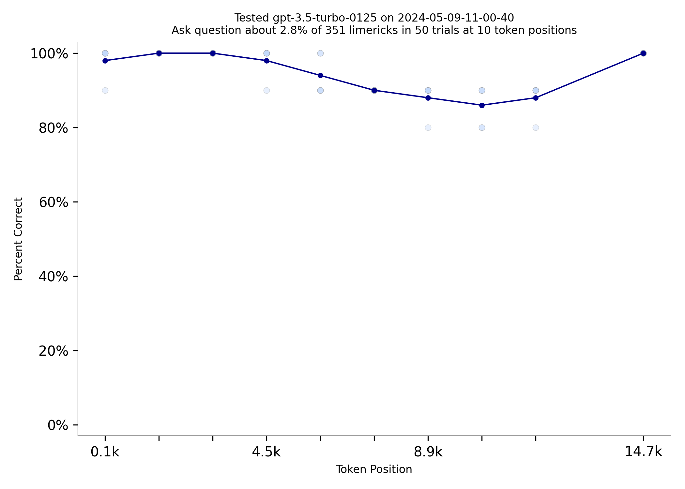

# GPT-4o's Memory Breakthrough! [(NIAN code)](https://github.com/llmonpy/needle-in-a-needlestack)
*by [Tom Burns](mailto:public@llmonpy.ai)*  

Needle in a Needlestack is a new benchmark to measure how well LLMs pay attention to the information in their context
window.  NIAN creates a prompt that includes thousands of limericks and the prompt asks a question about one limerick
at a specific location.  Here is an example prompt that [includes 2500ish limericks.](1/prompt.txt)  Until today, no
LLM was very good at this benchmark.  Here are GPT-4 Turbo and Claude-3 Sonnet's attempts at this benchmark:

|  |  |
|:-----------------------------------------------------------:|:--------------------------------------------------------------:|
|                   gpt-4-turbo-2024-04-09                    |                        claude-3-sonnet                         |

  
### However, GPT-4o has made a breakthrough!  Check out how well it does on this benchmark:

  

<em>Wow! GPT-4o is almost perfect</em>

  

###  I wonder when OpenAI will reveal what they did to make GPT-4o so much better than GPT-4 Turbo?
  
Mistral's models are really nice to work with.  Their API is very fast and consistent.
However, Mistral's new 8x22 model had a really hard time with this benchmark. Even at the beginning of the prompt it could only
answer the question correctly 50% of the time.  Mistral large did better, but still only got up to 70% correct. *Note: I used OpenAI's tokenizer to estimate token counts.  Mistral uses a different tokenizer that generates about 25% more
tokens, so the token counts in the graphs are lower than the actual token counts.*

|  |  |
|:-----------------------------------------:|:--------------------:|
|            open-mixtral-8x22b             |   mistral-large-latest-2024-04-09   |   

  
Models do quite a bit better with shorter prompts.  Here is Mistral 7b with a 16k-ish token prompt, vs 32k-ish

|  |        |
|:--------------------------------------:|:--------------------------:|
|       open-mistral-7b 16k tokens       | open-mistral-7b 32k tokens |   

  
Repeating information can make a very big difference on this test.  GPT-3.5-turbo does dramatically better when the
limerick the prompt asks about is repeated 10 times.

|  |  |
|:----------------------------------:|:-----------------------------------:|
|         limerick used once         |       limerick used 10 times        |   

  
The [code for this benchmark is here.](https://github.com/llmonpy/needle-in-a-needlestack)  It should be
easy to add support for additional models.  You can [read more about how answers are evaluated and questions are
vetted on the methodology page](https://nian.llmonpy.ai/methodology).  If you have any questions, please [contact me](mailto:public@llmonpy.ai)